<!-- ═══════════════════════════════════════════════════════════════════════════════════ -->
<!--   SIDDESH SHIROTE · AI/ML & SYSTEMS ENGINEER                                      -->
<!-- ═══════════════════════════════════════════════════════════════════════════════════ -->

  

<!-- MONOSPACE TYPING BANNER -->

 

<!-- PRIMARY STATUS BADGES -->
&nbsp;
&nbsp;
&nbsp;
&nbsp;

---

## 👋 &nbsp;About Me

I am a Computer Engineering undergraduate at **Vishwakarma Institute of Technology (VIT Pune)** (Batch of 2028).

My engineering work is centered on **AI/ML and Systems Engineering** — building end-to-end machine learning pipelines, deep learning models, and hardened AI infrastructure. My work bridges predictive modeling and adversarial AI defense: from real-time neural intrusion detection (A.I.R.S) and inline prompt-injection firewalls to low-level multithreaded C++ socket servers and spatial computer vision.

- 🎓 **Academics:** B.Tech in Computer Engineering @ **VIT Pune** (2024–2028)
- 🧠 **Domain Focus:** Machine Learning, Deep Learning, LLM Guardrails & Intelligent Systems
- 📍 **Location:** Pune, Maharashtra, India
- 🚀 **Current Focus:** Training and evaluating robust ML/LLM pipelines, model explainability (SHAP), and adversarial defenses

---

## 📦 &nbsp;Featured Systems

  
<strong>🛡️ LLM Prompt Injection Firewall</strong> · <code>group-k11</code> · <em>ML Pipeline &amp; Defense Lead</em>

   

  Enterprise-grade middleware defense proxy that protects LLM applications from adversarial prompt injections, multi-turn jailbreaks, and indirect prompt poisoning. Implements a 4-component weighted scoring formula `[SVM + MiniLM Transformer + Heuristic Rules + Encoding Anomaly]`, session escalation tracking with an in-memory ring buffer, and automatic fallback from OpenRouter to local Ollama.

  - **Role:** ML Pipeline & Model Training Lead (`group-k11` SE Project @ VIT Pune).
  - **Impact:** 85%+ detection accuracy on adversarial prompt injection benchmarks with real-time attack demonstration mode.
  - **Stack:** Python · FastAPI · Scikit-Learn · Sentence-Transformers · Next.js 14 · SQLite · OpenRouter / Ollama
  - **Repo:** [group-k11/LLM-Firewall-Prompt-Injection-Detection-System](https://github.com/group-k11/LLM-Firewall-Prompt-Injection-Detection-System)

  
<strong>🤖 A.I.R.S — Intelligent Intrusion Response System</strong> · <code>group-k11</code> · <em>Autonomous NIDS</em>

   

  Autonomous Network Intrusion Detection platform combining classical machine learning with LLM-assisted forensic triage. Ingests packet telemetry, detects malicious flows using Random Forest and Isolation Forest trained on the **CICIDS2017** dataset, generates per-prediction feature explainability via **SHAP TreeExplainer**, maps threats to **MITRE ATT&CK** techniques, and streams natural-language incident reports with recommended SOC actions.

  - **Role:** Core Collaborator @ `group-k11` (Detection Engine & Threat Explainability).
  - **Impact:** Automated threat triage and explainable anomaly alerts reducing alert fatigue for security operations.
  - **Stack:** Python · Flask · Scikit-Learn · SHAP · Anthropic Claude API · React + Vite · Recharts · CICIDS2017
  - **Repo:** [group-k11/EDI_SY](https://github.com/group-k11/EDI_SY)

  
<strong>☀️ SolarSense AR Platform</strong> · <code>Personal</code> · <em>Spatial Computing &amp; On-Device AI</em>

   

  100% on-device spatial computing tool built with Flutter 3 and native Kotlin OpenGL ES 2.0 (`ARRenderer`). Maps rooftop dimensions in real time with ARCore plane and depth detection, routes solar arrays around rooftop obstacles using on-device **YOLOv8n TFLite**, computes real-time solar irradiance via PVGIS, applies PM Surya Ghar subsidies, and exports an audit-ready 16-page PDF report without sending photos or metrics off-device.

  - **Role:** Solo Creator & Systems Developer.
  - **Impact:** Instant augmented reality rooftop solar feasibility assessment in under 2 minutes.
  - **Stack:** Flutter · Dart · Kotlin (ARRenderer) · YOLOv8n TFLite · Google ARCore · PVGIS · OpenGL ES
  - **Repo:** [Siddesh-bype/SolarSense_AR](https://github.com/Siddesh-bype/SolarSense_AR)

  
<strong>⚙️ HydroX — Smart Pump Health Digital Twin</strong> · <code>Hackathon</code> · <em>Predictive Telemetry &amp; RUL</em>

   

  Industrial IoT digital twin evaluating real-time vibrational, pressure, and thermal sensor streams. Extracts an 84-dimensional feature vector combining time-domain and FFT spectral descriptors, feeding an ensemble of Isolation Forest (unsupervised anomaly detection), a 5-class Random Forest (cavitation, bearing fault, dry run, misalignment, normal), and an LSTM Remaining Useful Life (RUL) predictor.

  - **Role:** ML Pipeline & Telemetry Engineer.
  - **Impact:** Early detection of impulsive degradation and mechanical drift with sub-second WebSocket broadcast.
  - **Stack:** Python · FastAPI · Scikit-Learn · PyTorch / LSTM · WebSockets · FFT Signal Analysis
  - **Repo:** [Siddesh-bype/HydroX-TESSERACT-26](https://github.com/Siddesh-bype/HydroX-TESSERACT-26)

  
<strong>🔒 Secure Socket Chat Engine</strong> · <code>group-k11</code> · <em>C++ POSIX Sockets &amp; React</em>

   

  Full-stack secure communication platform designed for Group K11's OOP project at VIT Pune. Features a custom multithreaded C++ socket server using POSIX sockets, dedicated connection handler classes, custom packet encryption, and password hashing, connected to a modern React frontend with Supabase authentication and WebSockets.

  - **Role:** Systems & Socket Architecture Collaborator (`group-k11` @ VIT Pune).
  - **Impact:** High-throughput encrypted byte streaming with zero third-party networking library dependencies.
  - **Stack:** C++ · POSIX Sockets · TCP/IP · Multithreading · React · Supabase · WebSockets
  - **Repo:** [Siddesh-bype/OOPs-Project-K11---Socket-based-Secure-Chat-App](https://github.com/Siddesh-bype/OOPs-Project-K11---Socket-based-Secure-Chat-App)

  
<strong>📦 Project Archive</strong> · <em>Full-Stack, Agents &amp; Telemetry</em>

   

  - **[Call-Shield](https://github.com/Siddesh-bype/call-shield)** — Real-time AI voice authenticity, deepfake, and social-engineering defense platform `(Python · Kotlin · Android)`.
  - **[Bias-Aware 360° Review Desk](https://github.com/Siddesh-bype/bias-aware-360-review-system)** — Human-in-the-loop review pipeline with automated claim citation and bias verification `(Python · FastAPI · NLP)`.
  - **[Retail POS &amp; Inventory Engine](https://github.com/group-k11/Mobile-app-development)** — Mobile inventory tracking with barcode scanning, expiry alerts, and offline sync `(Flutter · Dart · Firebase)`.
  - **[SaaS Spend-Waste Agent](https://github.com/Siddesh-bype/SaaS-Spend-Waste-Agent)** — Autonomous automation agent auditing cloud subscriptions to eliminate recurring waste `(Python · GenAI · Tooling)`.
  - **[ProbeIQ](https://github.com/Siddesh-bype/ProbeIQ)** — High-speed API health diagnostics and real-time latency inspection `(Python · FastAPI · Telemetry)`.

---

## 🎯 &nbsp;Availability &amp; Opportunity Filter

| Parameter | Current Status &amp; Preferences |
|:---|:---|
| **Academics** | B.Tech Computer Engineering (2024–2028) @ **VIT Pune** |
| **Target Roles** | AI/ML Engineer Intern · Machine Learning Research Intern · Systems / Backend Intern · AI Security Intern |
| **Availability** | Summer 2027 Internships · Off-Cycle &amp; Part-Time Research Collaborations |
| **Location &amp; Timezone** | Pune, India (IST / UTC+5:30) · Open to Remote, Hybrid, or On-site |
| **What I'm Looking For** | Teams shipping production machine learning systems, deep learning pipelines, adversarial AI robustness, low-level network systems, or resilient backends |
| **What I'm NOT Looking For** | Unpaid marketing roles, generic form-builder tasks, or crypto speculation projects |

---

## 🛠️ &nbsp;Tech Stack

### Programming Languages

  &nbsp;&nbsp;
  &nbsp;&nbsp;
  &nbsp;&nbsp;
  &nbsp;&nbsp;
  &nbsp;&nbsp;
  &nbsp;&nbsp;
  &nbsp;&nbsp;
  

### AI, Machine Learning &amp; Deep Learning

  &nbsp;&nbsp;
  &nbsp;&nbsp;
  &nbsp;&nbsp;
  &nbsp;&nbsp;
  

### Frameworks &amp; Web Development

  &nbsp;&nbsp;
  &nbsp;&nbsp;
  &nbsp;&nbsp;
  &nbsp;&nbsp;
  &nbsp;&nbsp;
  &nbsp;&nbsp;
  &nbsp;&nbsp;
  

### Mobile, Cloud &amp; Systems

  &nbsp;&nbsp;
  &nbsp;&nbsp;
  &nbsp;&nbsp;
  &nbsp;&nbsp;
  &nbsp;&nbsp;
  &nbsp;&nbsp;
  

### Databases &amp; Backend Tools

  &nbsp;&nbsp;
  &nbsp;&nbsp;
  &nbsp;&nbsp;
  &nbsp;&nbsp;
  &nbsp;&nbsp;
  &nbsp;&nbsp;
  

---

## 📊 &nbsp;GitHub Analytics

&nbsp;&nbsp;

  

---

## 🐍 &nbsp;Contribution Graph

  

---

## 📫 &nbsp;Connect With Me

&nbsp;
&nbsp;
&nbsp;

